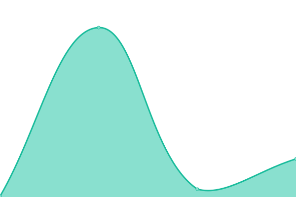

# [📈 Live Status](https://status.rhope.app): <!--live status--> **🟧 Partial outage**

This repository contains the open-source uptime monitor and status page for [OviTr](https://status.rhope.app), powered by [Upptime](https://github.com/upptime/upptime).

With [Upptime](https://upptime.js.org), you can get your own unlimited and free uptime monitor and status page, powered entirely by a GitHub repository. We use [Issues](https://github.com/Ovi-Tr/rhope-status/issues) as incident reports, [Actions](https://github.com/Ovi-Tr/rhope-status/actions) as uptime monitors, and [Pages](https://status.rhope.app) for the status page.

<!--start: status pages-->
<!-- This summary is generated by Upptime (https://github.com/upptime/upptime) -->
<!-- Do not edit this manually, your changes will be overwritten -->
<!-- prettier-ignore -->
| URL | Status | History | Response Time | Uptime |
| --- | ------ | ------- | ------------- | ------ |
|  [rhope app](https://app.rhope.app/) | 🟥 Down | [rhope-app.yml](https://github.com/Ovi-Tr/rhope-status/commits/HEAD/history/rhope-app.yml) | 

 0ms
     
 | 

<a href="https://status.rhope.app/history/rhope-app">0.00%</a>
    

|  [rhope API](https://api.rhope.app/api/health) | 🟥 Down | [rhope-api.yml](https://github.com/Ovi-Tr/rhope-status/commits/HEAD/history/rhope-api.yml) | 

 0ms
     
 | 

<a href="https://status.rhope.app/history/rhope-api">0.00%</a>
    

|  [rhope WebSocket](https://api.rhope.app/ws/info) | 🟥 Down | [rhope-web-socket.yml](https://github.com/Ovi-Tr/rhope-status/commits/HEAD/history/rhope-web-socket.yml) | 

 0ms
     
 | 

<a href="https://status.rhope.app/history/rhope-web-socket">0.00%</a>
    

|  [rhope app staging](https://rhope-ssr-staging.fly.dev/) | 🟩 Up | [rhope-app-staging.yml](https://github.com/Ovi-Tr/rhope-status/commits/HEAD/history/rhope-app-staging.yml) | 

 1722ms
     
 | 

<a href="https://status.rhope.app/history/rhope-app-staging">100.00%</a>
    

|  [rhope API staging](https://rhope-backend-staging.fly.dev/api/health) | 🟩 Up | [rhope-api-staging.yml](https://github.com/Ovi-Tr/rhope-status/commits/HEAD/history/rhope-api-staging.yml) | 

 103ms
     
 | 

<a href="https://status.rhope.app/history/rhope-api-staging">77.40%</a>
    

<!--end: status pages-->

[**Visit our status website →**](https://status.rhope.app)

## 📄 License

- Powered by: [Upptime](https://github.com/upptime/upptime)
- Code: [MIT](./LICENSE) © [Anand Chowdhary](https://anandchowdhary.com), supported by [Pabio](https://pabio.com)
- Data in the `./history` directory: [Open Database License](https://opendatacommons.org/licenses/odbl/1-0/)
